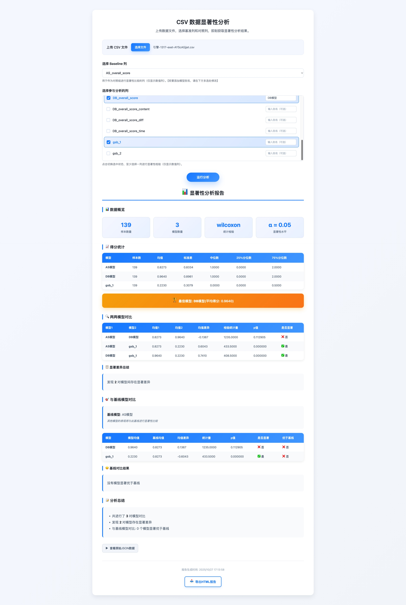

# CSV 数据显著性分析工具

一个基于 Web 的 CSV 数据显著性分析工具，采用前后端分离架构，使用 Nginx 反向代理提供统一服务入口。



## ✨ 特性

- 📊 **专业统计分析**：Wilcoxon、t检验、Mann-Whitney U 检验
- 🎨 **美观的报告展示**：数据概览、统计表格、显著性判断
- 📁 **大文件支持**：支持最大 1024MB CSV 文件上传
- �� **智能列过滤**：自动识别并过滤非数值列
- 🏷️ **列别名**：为数据列设置自定义别名
- 💾 **报告导出**：导出完整的 HTML 格式报告
- 🚀 **一键启动**：使用 Nginx 统一入口，无跨域问题

## 🏗️ 技术架构

```
浏览器 (http://localhost:8080)
    ↓
Nginx (端口 8080)
    ├── / → 静态文件服务（frontend/）
    └── /api/* → 反向代理
            ↓
        Flask 后端 (端口 5000)
```

**技术栈**：
- 前端：React 18 (CDN)、HTML5、CSS3
- 后端：Flask、Pandas、NumPy、SciPy
- 部署：Nginx 反向代理
- 环境：UV (Python 包管理器)

## 🚀 快速开始

### 1. 一键启动

```bash
./start.sh
```

### 2. 访问应用

在浏览器打开：**http://localhost:8080**

### 3. 使用流程

1. 上传 CSV 文件（最大 1024MB）
2. 选择 Baseline 列（基准列）
3. 选择参与分析的数据列（支持多选）
4. （可选）为列设置别名
5. 点击"运行分析"
6. 查看美化的报告结果
7. 导出 HTML 报告

### 4. 停止服务

快速关闭后端与 Nginx 服务：
```bash
./kill.sh
```

## 📖 详细文档

- **[快速启动指南](./QUICKSTART.md)** - 启动方式、故障排除、使用说明
- **[项目配置文档](./PROJECT_SETUP.md)** - 技术架构、API 接口、功能列表

## 📁 项目结构

```
.
├── backend/                    # 后端代码
│   ├── app.py                      # Flask API 服务
│   ├── model_comparison_tool.py    # 核心分析工具
│   └── pyproject.toml              # UV 项目配置
├── frontend/                       # 前端代码
│   ├── index.html              # 主页面
│   ├── app.js                      # React 应用逻辑
│   ├── style.css                   # 样式表
│   └── icons8-94.png               # 网页图标
├── nginx/                      # Nginx 配置
│   └── nginx.conf                  # 反向代理配置
├── data/                       # 数据文件目录
├── start.sh                    # 主启动脚本
├── kill.sh                     # 服务关闭脚本
├── start_frontend.sh           # 前端启动脚本
├── start_backend.sh            # 后端启动脚本
├── start_nginx.sh              # Nginx 启动脚本
├── QUICKSTART.md               # 快速启动指南
└── PROJECT_SETUP.md            # 项目配置文档
```

## 🔬 核心功能

### 数据处理
- CSV 文件上传与解析（最大 1024MB）
- 自动检测数值列
- 智能过滤非数值列

### 统计分析
- Wilcoxon 符号秩检验
- 配对 t 检验
- Mann-Whitney U 检验
- 两两模型对比
- 基线模型对比

### 结果展示
- 数据概览卡片
- 得分统计表格
- 显著性检验结果
- 最佳模型高亮
- 分析总结报告

### 高级功能
- 列别名设置
- HTML 报告导出
- 原始 JSON 数据查看

---

## ❓ 常见问题

### 如何修改端口？

编辑 `nginx/nginx.conf` 修改 Nginx 端口（默认 8080）：
```nginx
listen 8081;  # 改为其他端口
```

编辑 `backend/app.py` 修改后端端口（默认 5000）：
```python
app.run(host='0.0.0.0', port=5001, debug=True)
```

### 文件上传失败（413 错误）？

已支持 1024MB 文件上传，如需修改：

编辑 `nginx/nginx.conf` 修改 Nginx 最大文件大小：
```nginx
client_max_body_size 1024M;     # 改为更大值
```

编辑 `backend/app.py` 修改 Flask 最大文件大小：
```python
app.config['MAX_CONTENT_LENGTH'] = 1024 * 1024 * 1024   # 改为更大值
```

然后重新加载配置：
```bash
./start.sh
```

### 前端修改不生效？

修改前端文件后需要刷新 Nginx：
```bash
nginx -s reload -c /data/workspace/nginx/nginx.conf
```

并在浏览器中强制刷新（Ctrl+Shift+R）。

更多问题请查看 **[快速启动指南](./QUICKSTART.md)** 中的故障排除章节。

## 📊 示例数据

CSV 文件格式示例：

```csv
id,baseline_model,model_a,model_b,model_c
1,0.85,0.78,0.92,0.88
2,0.76,0.81,0.88,0.85
3,0.92,0.85,0.91,0.89
...
```

## 🤝 贡献

欢迎提交 Issue 和 Pull Request！

## 📄 许可证

本项目基于 MIT 许可证开源，详情请查看 [LICENSE](./LICENSE) 文件。

---

**祝使用愉快！** 🎉
